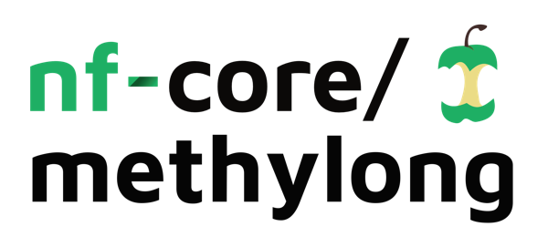
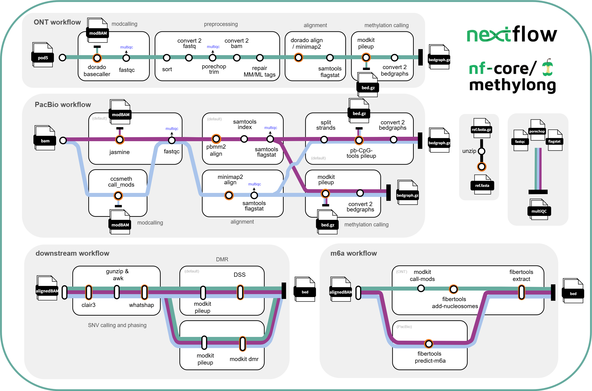

<h1>
  <picture>
    <source media="(prefers-color-scheme: dark)" srcset="docs/images/nf-core-methylong_logo_dark.png">
    
  </picture>
</h1>

[](https://github.com/nf-core/methylong/actions/workflows/ci.yml)
[](https://github.com/nf-core/methylong/actions/workflows/linting.yml)[](https://nf-co.re/methylong/results)[](https://doi.org/10.5281/zenodo.XXXXXXX)
[](https://www.nf-test.com)

[](https://www.nextflow.io/)
[](https://docs.conda.io/en/latest/)
[](https://www.docker.com/)
[](https://sylabs.io/docs/)
[](https://cloud.seqera.io/launch?pipeline=https://github.com/nf-core/methylong)

[](https://nfcore.slack.com/channels/methylong)

## Introduction

**nf-core/methylong** is a bioinformatics pipeline that is tailored for long-read methylation calling. This pipeline requires a genome reference as input, and can take either modification-basecalled ONT reads, PacBio HiFi reads (modBam), raw sequencing Pod5 reads or raw Bam reads. The ONT workflow includes modcalling (optional), preprocessing (trim and repair) of reads, genome alignment and methylation calling. The PacBio HiFi workflow includes modcalling (optional), genome alignment and methylation calling. Methylation calls are extracted into BED/BEDGRAPH format, readily for direct downstream analysis. The downstream workflow includes SNV calling, phasing and DMR analysis.

<p align="center">
  

</p>

### ONT workflow:

1. modcalling (optional)
   - basecall pod5 reads to modBam - `dorado basecaller`
   - optional: m6A call - `fibertools add-nucleosomes`
2. trim and repair tags of input modBam
   - trim and repair workflow:
     1. sort modBam - `samtools sort`
     2. convert modBam to fastq - `samtools fastq`
     3. trim barcode and adapters - `porechop`
     4. convert trimmed modfastq to modBam - `samtools import`
     5. repair MM/ML tags of trimmed modBam - `modkit repair`
3. align to reference (plus sorting and indexing) - `dorado aligner`( default) / `minimap2`

   - optional: remove previous alignment information before running `dorado aligner` using `samtools reset`
   - include alignment summary - `samtools flagstat`

4. create bedMethyl - `modkit pileup`, 5x base coverage minimum.
   - optional: extract m6A information into bedMethyl - `fibertools extract`
5. create bedgraphs (optional)

### PacBio workflow:

1. modcalling (optional)

   - modcall bam reads to modBam - `jasmine` (default) or `ccsmeth`
   - optional: m6A call - `fibertools predict-m6a`

2. align to reference - `pbmm2` (default) or `minimap2`

   - minimap workflow:

     1. convert modBam to fastq - `samtools convert`
     2. alignment - `minimap2`
     3. sort and index - `samtools sort`
     4. alignment summary - `samtools flagstat`

   - pbmm2 workflow:
     1. alignment and sorting - `pbmm2`
     2. index - `samtools index`
     3. alignment summary - `samtools flagstat`

3. create bedMethyl - `pb-CpG-tools` (default) or `modkit pileup`

   - notes about using `pb-CpG-tools` pileup:

     - 5x base coverage minimum.
     - 2 pile up methods available from `pb-CpG-tools`:
       1. default using `model`
       2. or `count` (differences described here: https://github.com/PacificBiosciences/pb-CpG-tools)
     - `pb-CpG-tools` by default merge mC signals on CpG into forward strand. To 'force' strand specific signal output, I followed the suggestion mentioned in this issue ([PacificBiosciences/pb-CpG-tools#37](https://github.com/PacificBiosciences/pb-CpG-tools/issues/37)) which uses HP tags to tag forward and reverse reads, so they were output separately.

   - optional: extract m6A information into bedMethyl - `fibertools extract`

4. create bedgraph (optional)

### Downstream workflow:

1. SNV calling - `clair3`
2. phasing - `whatshap phase`
3. DMR analysis

   - includes DMR haplotype level and population scale:

     1. tag reads by haplotype - `whatshap haplotype`
     2. create bedMethyl - `modkit pileup`
     3. DMR - `DSS` (default) or `modkit dmr`

## Usage

> [!NOTE]
> Currently no support of `dorado` and `pb-CpG-tools` through conda.

> [!NOTE]
> The pipeline can identify whether ONT reads are in pod5 or bam format, and automatically determine whether to perform `basecalling`.

> [!NOTE]
> If you are new to Nextflow and nf-core, please refer to [this page](https://nf-co.re/docs/usage/installation) on how to set-up Nextflow. Make sure to [test your setup](https://nf-co.re/docs/usage/introduction#how-to-run-a-pipeline) with `-profile test` before running the workflow on actual data.

### Required input:

- ONT or PacBio HiFi reads
  - unaligned modification basecalled bam (modBam)
  - if input modBam was aligned, remove previous alignment information using `--reset`
  - raw ONT pod5
  - raw bam
- reference genome

First, prepare a samplesheet with your input data that looks as follows:

```csv title="samplesheet.csv"
group,sample,path,ref,method
test,Col_0,ont_modbam.bam,Col_0.fasta,ont

```

| Column   | Content                        |
| -------- | ------------------------------ |
| `group`  | Group of the sample            |
| `sample` | Name of the sample             |
| `path`   | Path to sample file            |
| `ref`    | Path to assembly fasta/fa file |
| `method` | specify ont / pacbio           |

Now, you can run the pipeline using:

```bash
nextflow run nf-core/methylong \
   -profile <docker/singularity/.../institute> \
   --input samplesheet.csv \
   --outdir <OUTDIR>
```

> [!WARNING]
> Please provide pipeline parameters via the CLI or Nextflow `-params-file` option. Custom config files including those provided by the `-c` Nextflow option can be used to provide any configuration _**except for parameters**_; see [docs](https://nf-co.re/docs/usage/getting_started/configuration#custom-configuration-files).

For more details and further functionality, please refer to the [usage documentation](https://nf-co.re/methylong/usage) and the [parameter documentation](https://nf-co.re/methylong/parameters).

## Pipeline output

To see the results of an example test run with a full size dataset refer to the [results](https://nf-co.re/methylong/results) tab on the nf-core website pipeline page.
For more details about the output files and reports, please refer to the
[output documentation](https://nf-co.re/methylong/output).

Folder stuctures of the outputs:

```tree

├── ont/sampleName
│   │
│   ├── fastqc
│   │
│   ├── basecall
│   │   └── calls.bam
│   │
│   ├── trim
│   │   ├── trimmed.fastq.gz
│   │   └── trimmed.log
│   │
│   ├── repair
│   │   ├── repaired.bam
│   │   └── repaired.log
│   │
│   ├── alignment
│   │   ├── aligned.bam
│   │   ├── aligned.bai
│   │   └── aligned.flagstat
│   │
│   ├── snvcall
│   │   ├── merge_output.vcf.gz
│   │   ├── merge_output.vcf.gz.tbi
│   │   └── SNV_PASS.vcf
│   │
│   ├── phase
│   │   ├── phased.vcf
│   │   ├── haplotagged.bam
│   │   └── haplotagged.readlist
│   │
│   ├── pileup/modkit
│   │   ├── pileup.bed.gz
│   │   └── pileup.log
│   │
│   ├── bedgraph
│   │   └── bedgraphs
│   │
│   ├── dmr_haplotype_level/dss
│   │   ├── preprocessed_<1|2|etc>.bed
│   │   ├── DSS_DMLtest.txt
│   │   ├── DSS_callDML.txt
│   │   ├── DSS_callDMR.txt
│   │   └── DSS.log
│   │
│   └── dmr_population_scale
│       ├── population_scale_DMLtest.txt
│       ├── population_scale_callDML.txt
│       ├── population_scale_callDMR.txt
│       └── population_scale.log
│
│
├── pacbio/sampleName
│   │
│   ├── fastqc
│   │
│   ├── modcall
│   │   ├── modbam.bam
│   │   ├── m6a_predicted.bam
│   │   └── m6a.bed
│   │
│   ├── aligned_minimap2/ aligned_pbmm2
│   │   ├── aligned.bam
│   │   ├── aligned.bai/csi
│   │   └── aligned.flagstat
│   │
│   ├── pileup: modkit/pb_cpg_tools
│   │   ├── pileup.bed.gz
│   │   ├── pileup.log
│   │   └── pileup.bw (only pb_cpg_tools)
│   │
│   ├── snvcall
│   │   ├── merge_output.vcf.gz
│   │   └── SNV_PASS.vcf
│   │
│   ├── phase
│   │   ├── phased.vcf
│   │   ├── haplotagged.bam
│   │   └── haplotagged.readlist
│   │
│   ├── bedgraph
│   │   └── bedgraphs
│   │
│   ├── dmr_haplotype_level/dss
│   │   ├── preprocessed_1.bed
│   │   ├── preprocessed_2.bed
│   │   ├── DSS_DMLtest.txt
│   │   ├── DSS_callDML.txt
│   │   ├── DSS_callDMR.txt
│   │   └── DSS.log
│   │
│   └── dmr_population_scale
│       ├── population_scale_DMLtest.txt
│       ├── population_scale_callDML.txt
│       ├── population_scale_callDMR.txt
│       └── population_scale.log
│
│
└── multiqc
    │
    ├── fastqc
    └── flagstat

```

bedgraph outputs all have min. 5x base coverage.

## Credits

nf-core/methylong was originally written by [Jin Yan Khoo](https://github.com/jkh00), from the Faculty of Biology of the Ludwig-Maximilians University (LMU) in Munich, Germany, further contributions were made by [Yi Jin Xiong](https://github.com/YiJin-Xiong), from Central South University (CSU) in Changsha, China.

I thank the following people for their extensive assistance in the development of this pipeline:

- [Felix Lenner](https://github.com/fellen31)
- [Júlia Mir Pedrol](https://github.com/mirpedrol)
- [Matthias Hörtenhuber](https://github.com/mashehu)
- [Sateesh Peri](https://github.com/sateeshperi)
- [Niklas Schandry](https://github.com/nschan)

## Contributions and Support

If you would like to contribute to this pipeline, please see the [contributing guidelines](.github/CONTRIBUTING.md).

For further information or help, don't hesitate to get in touch on the [Slack `#methylong` channel](https://nfcore.slack.com/channels/methylong) (you can join with [this invite](https://nf-co.re/join/slack)).

## Citations

<!-- TODO nf-core: Add citation for pipeline after first release. Uncomment lines below and update Zenodo doi and badge at the top of this file. -->

If you use nf-core/methylong for your analysis, please cite it using the following doi: [10.5281/zenodo.15366448](https://doi.org/10.5281/zenodo.15366448)

<!-- TODO nf-core: Add bibliography of tools and data used in your pipeline -->

An extensive list of references for the tools used by the pipeline can be found in the [`CITATIONS.md`](CITATIONS.md) file.

You can cite the `nf-core` publication as follows:

> **The nf-core framework for community-curated bioinformatics pipelines.**
>
> Philip Ewels, Alexander Peltzer, Sven Fillinger, Harshil Patel, Johannes Alneberg, Andreas Wilm, Maxime Ulysse Garcia, Paolo Di Tommaso & Sven Nahnsen.
>
> _Nat Biotechnol._ 2020 Feb 13. doi: [10.1038/s41587-020-0439-x](https://dx.doi.org/10.1038/s41587-020-0439-x).
