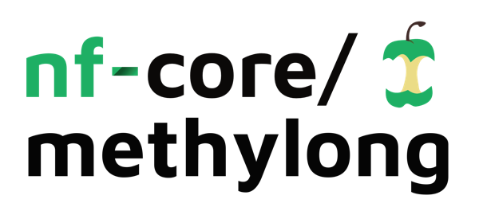

<h1>
  <picture>
    <source media="(prefers-color-scheme: dark)" srcset="docs/images/nf-core-methylong_logo_dark.png">
    
  </picture>
</h1>

[](https://github.com/codespaces/new/nf-core/methylong)
[](https://github.com/nf-core/methylong/actions/workflows/nf-test.yml)
[](https://github.com/nf-core/methylong/actions/workflows/linting.yml)[](https://nf-co.re/methylong/results)[](https://doi.org/10.5281/zenodo.15366448)
[](https://www.nf-test.com)

[](https://www.nextflow.io/)
[](https://github.com/nf-core/tools/releases/tag/3.5.1)
[](https://docs.conda.io/en/latest/)
[](https://www.docker.com/)
[](https://sylabs.io/docs/)
[](https://cloud.seqera.io/launch?pipeline=https://github.com/nf-core/methylong)

[](https://nfcore.slack.com/channels/methylong)

## Introduction

**nf-core/methylong** is a bioinformatics pipeline that is tailored for long-read methylation calling. This pipeline requires a genome reference as input, and can take either modification-basecalled ONT reads, PacBio HiFi reads (modBam), raw sequencing Pod5 reads or raw Bam reads. The ONT workflow includes modcalling (optional), preprocessing (trim and repair) of reads, genome alignment and methylation calling. The PacBio HiFi workflow includes modcalling (optional), genome alignment and methylation calling. Methylation calls are extracted into BED/BEDGRAPH format, readily for direct downstream analysis. The downstream workflow includes SNV calling, phasing and DMR analysis.

<p align="center">
  

</p>

### ONT workflow:

1. modcalling (optional)
   - basecall pod5 reads to modBam - `dorado basecaller sup --modified-bases 5mC_5hmC` (default)
2. trim and repair tags of input modBam
   - trim and repair workflow:
     1. sort modBam - `samtools sort`
     2. convert modBam to fastq - `samtools fastq`
     3. trim barcode and adapters - `porechop`
     4. convert trimmed modfastq to modBam - `samtools import`
     5. repair MM/ML tags of trimmed modBam - `modkit repair`
3. align to reference (plus sorting and indexing) - `dorado aligner`(default) / `minimap2`
   - optional: remove previous alignment information before running `dorado aligner` using `samtools reset`
   - include alignment summary - `samtools flagstat`
4. create bedMethyl - `modkit pileup`, 5x base coverage minimum.
5. create bedgraphs (optional)

### PacBio workflow:

1. modcalling (optional)
   - modcall bam reads to modBam - `jasmine` (default) or `ccsmeth`

2. align to reference - `pbmm2` (default) or `minimap2`
   - minimap workflow:
     1. convert modBam to fastq - `samtools convert`
     2. alignment - `minimap2`
     3. sort and index - `samtools sort`
     4. alignment summary - `samtools flagstat`

   - pbmm2 workflow:
     1. alignment and sorting - `pbmm2`
     2. index - `samtools index`
     3. alignment summary - `samtools flagstat`

3. create bedMethyl - `pb-CpG-tools` (default) or `modkit pileup`
   - notes about using `pb-CpG-tools` pileup:
     - 5x base coverage minimum.
     - 2 pile up methods available from `pb-CpG-tools`:
       1. default using `model`
       2. or `count` (differences described here: https://github.com/PacificBiosciences/pb-CpG-tools)
     - `pb-CpG-tools` by default merge mC signals on CpG into forward strand. To 'force' strand specific signal output, I followed the suggestion mentioned in this issue ([PacificBiosciences/pb-CpG-tools#37](https://github.com/PacificBiosciences/pb-CpG-tools/issues/37)) which uses HP tags to tag forward and reverse reads, so they were output separately.

4. create bedgraph (optional)

### Downstream workflow:

1. SNV calling - `clair3`
2. phasing - `whatshap phase`
3. DMR analysis
   - includes DMR haplotype level and population scale:
     1. tag reads by haplotype - `whatshap haplotype`
     2. create bedMethyl - `modkit pileup`
     3. DMR - `DSS` (default) or `modkit dmr` (default when `--all-context` is set)
        - in `DSS` , only regions with statistically significant CpG sites will be detected as DMRs.

### Fiberseq workflow:

- ONT alignedBAM
  1. filtering m6A calls - `modkit call-mods`
  2. infer nucleosomes and MSPs - `ft add-nucleosomes`
  3. create bedMethyl - `ft extract`
- PacBio alignedBAM
  1. predict m6a and infer nucleosomes - `ft predict-m6a`
  2. create bedMethyl - `ft extract`

## Installation

Before running nf-core/methylong, make sure that [Nextflow](https://www.nextflow.io/) and a supported software environment such as Docker, Singularity/Apptainer, or Conda are installed. If you are new to Nextflow or nf-core, see the [nf-core installation documentation](https://nf-co.re/docs/usage/installation).

There are two ways to obtain and run nf-core/methylong.

### Option 1: Run directly with Nextflow

nf-core/methylong can be launched directly from the remote nf-core repository:

```bash
nextflow run nf-core/methylong \
    -profile <docker/singularity/conda/...> \
    --input samplesheet.csv \
    --outdir results
```

This method requires Nextflow to access the GitHub API. If GitHub credentials are not configured, unauthenticated requests may reach the GitHub API rate limit and result in:

```text
API rate limit exceeded
```

If this occurs, either configure GitHub authentication for Nextflow using a GitHub Personal Access Token (see the [Nextflow Git documentation](https://www.nextflow.io/docs/latest/git.html)) or use the local installation below.

### Option 2: Clone and run locally (recommended)

For routine use, we recommend cloning the methylong repository and running the pipeline locally:

```bash
git clone https://github.com/nf-core/methylong.git
cd methylong
```

Then run:

```bash
nextflow run main.nf \
    -profile <docker/singularity/conda/...> \
    --input samplesheet.csv \
    --outdir results
```

## Usage

> [!NOTE]
> `dorado` and `pb-CpG-tools` are currently not supported through Conda.

### Supported input types

nf-core/methylong supports different input types for ONT and PacBio data. The input type determines the starting point of the workflow.

| Platform | Input type                                     | Workflow starting point            |
| -------- | ---------------------------------------------- | ---------------------------------- |
| ONT      | POD5                                           | Basecalling                        |
| ONT      | modBAM (unaligned modification basecalled BAM) | Read preprocessing and alignment   |
| PacBio   | HiFi BAM (raw BAM)                             | Modification calling and alignment |
| PacBio   | modBAM (unaligned modification basecalled BAM) | Alignment and methylation calling  |

> [!NOTE]
>
> - For ONT data, methylong automatically distinguishes POD5 from BAM input and determines whether basecalling is required.
> - For PacBio data, raw BAM and modBAM inputs should not be included in the same samplesheet because they enter the workflow at different starting points.

### Samplesheet

All supported input types use the same five-column samplesheet format:

```csv
group,sample,path,ref,method
```

Example:

```csv title="samplesheet.csv"
group,sample,path,ref,method
test1,ONT_Col_0_pod5,/absolute/path/to/ont_reads.pod5,/absolute/path/to/Col_0.fasta,ont
test2,ONT_Col_0_bam,/absolute/path/to/ont_modbam.bam,/absolute/path/to/Col_0.fasta,ont
test3,PacBio_Col_0_bam,/absolute/path/to/pacbio_bam.bam,/absolute/path/to/Col_0.fasta,pacbio
```

| Column   | Description                                |
| -------- | ------------------------------------------ |
| `group`  | Sample group                               |
| `sample` | Sample name                                |
| `path`   | Path to the input BAM or POD5 data         |
| `ref`    | Path to the reference genome FASTA/FA file |
| `method` | Sequencing platform: `ont` or `pacbio`     |

> [!IMPORTANT]
>
> Absolute paths are recommended. Relative paths are also supported and are resolved relative to the methylong project directory.

### Detailed usage examples

Please refer to [`docs/usage.md`](docs/usage.md) for commands corresponding to different input types and analysis scenarios. For a complete list of available parameters, see the [parameter documentation](https://nf-co.re/methylong/parameters).

> [!WARNING]
> Please provide pipeline parameters via the CLI or Nextflow `-params-file` option. Custom config files including those provided by the `-c` Nextflow option can be used to provide any configuration _**except for parameters**_; see [docs](https://nf-co.re/docs/usage/getting_started/configuration#custom-configuration-files).

## Testing

A minimal built-in test can be run after cloning the repository:

```bash
nextflow run main.nf --outdir ./results -profile test,singularity
```

We recommend running this test to verify the Nextflow setup, software environment, and basic methylong workflow.

Representative test datasets for the following supported input scenarios are available in the [nf-core test-datasets repository](https://github.com/nf-core/test-datasets/tree/methylong/v2.0.0/test_data):

| Scenario              | Demo samplesheet                                                                                                                                      |
| --------------------- | ----------------------------------------------------------------------------------------------------------------------------------------------------- |
| ONT BAM               | [`test_samplesheet.csv`](https://github.com/nf-core/test-datasets/blob/methylong/v2.0.0/test_data/test_samplesheet.csv)                               |
| ONT POD5              | [`test_samplesheet_pod5.csv`](https://github.com/nf-core/test-datasets/blob/methylong/v2.0.0/test_data/test_samplesheet_pod5.csv)                     |
| PacBio modBAM         | [`full_test_samplesheet.csv`](https://github.com/nf-core/test-datasets/blob/methylong/v2.0.0/test_data/full_test_samplesheet.csv)                     |
| PacBio unmodified BAM | [`test_samplesheet_unmodified_bam.csv`](https://github.com/nf-core/test-datasets/blob/methylong/v2.0.0/test_data/test_samplesheet_unmodified_bam.csv) |

## Pipeline output

To see the results of an example test run with a full size dataset refer to the [results](https://nf-co.re/methylong/results) tab on the nf-core website pipeline page.
For more details about the output files and reports, please refer to the
[output documentation](https://nf-co.re/methylong/output).

Folder stuctures of the outputs:

```tree

├── ont/sampleName
│   │
│   ├── fastqc
│   │
│   ├── basecall
│   │   └── calls.bam
│   │
│   ├── fiberseq
│   │   ├── m6acall.bam
│   │   └── m6a.bed
│   │
│   ├── trim
│   │   ├── trimmed.fastq.gz
│   │   └── trimmed.log
│   │
│   ├── repair
│   │   ├── repaired.bam
│   │   └── repaired.log
│   │
│   ├── alignment
│   │   ├── aligned.bam
│   │   ├── aligned.bai
│   │   └── aligned.flagstat
│   │
│   ├── snvcall
│   │   ├── merge_output.vcf.gz
│   │   ├── merge_output.vcf.gz.tbi
│   │   └── SNV_PASS.vcf
│   │
│   ├── phase
│   │   ├── phased.vcf.gz
│   │   ├── haplotagged.bam
│   │   └── haplotagged.readlist
│   │
│   ├── pileup
│   │   ├── pileup.bed.gz
│   │   └── pileup.log
│   │
│   ├── bedgraph
│   │   └── <CG|CHG|CHH|A>.bedgraph.gz
│   │
│   ├── dmr_haplotype_level
│   │   ├── phased_pileup
│   │   │   ├── hp1.bed.gz
│   │   │   ├── hp2.bed.gz
│   │   │   └── combined.bed.gz
│   │   └── dmr:modkit/dss
│   │       ├── preprocessed_<1|2|etc>.bed
│   │       ├── DSS_DMLtest.txt
│   │       ├── DSS_callDML.txt
│   │       ├── DSS_callDMR.txt
│   │       └── DSS.log
│   │       ├── group1_group2_modkit.bed.gz
│   │       └── group1_group2_modkit_dmr.log
│   │
│   └── dmr_population_scale
│       ├── group_pileup
│       │   ├── group1.bed.gz
│       │   └── group2.bed.gz
│       └── group1_group2:dmr:modkit/dss
│           ├── population_scale_DMLtest.txt
│           ├── population_scale_callDML.txt
│           ├── population_scale_callDMR.txt
│           └── population_scale.log
│           ├── group1_group2_modkit.bed.gz
│           └── group1_group2_modkit_dmr.log
│
├── pacbio/sampleName
│   │
│   ├── fastqc
│   │
│   ├── modcall
│   │   └── modbam.bam
│   │
│   ├── fiberseq
│   │   ├── m6a_predicted.bam
│   │   └── m6a.bed
│   │
│   ├── alignment
│   │   ├── aligned.bam
│   │   ├── aligned.bai/csi
│   │   └── aligned.flagstat
│   │
│   ├── pileup: modkit/pb_cpg_tools
│   │   ├── pileup.bed.gz
│   │   ├── pileup.log
│   │   └── pileup.bw (only pb_cpg_tools)
│   │
│   ├── snvcall
│   │   ├── merge_output.vcf.gz
│   │   └── SNV_PASS.vcf
│   │
│   ├── phase
│   │   ├── phased.vcf.gz
│   │   ├── haplotagged.bam
│   │   └── haplotagged.readlist
│   │
│   ├── bedgraph
│   │   └── bedgraphs
│   │
│   ├── dmr_haplotype_level
│   │   ├── phased_pileup
│   │   │   ├── hp1.bed.gz
│   │   │   ├── hp2.bed.gz
│   │   │   └── combined.bed.gz
│   │   └── dmr:modkit/dss
│   │       ├── preprocessed_<1|2|etc>.bed
│   │       ├── DSS_DMLtest.txt
│   │       ├── DSS_callDML.txt
│   │       ├── DSS_callDMR.txt
│   │       └── DSS.log
│   │       ├── group1_group2_modkit.bed.gz
│   │       └── group1_group2_modkit_dmr.log
│   │
│   └── dmr_population_scale
│       ├── group_pileup
│       │   ├── group1.bed.gz
│       │   └── group2.bed.gz
│       └── group1_group2:dmr:modkit/dss
│           ├── population_scale_DMLtest.txt
│           ├── population_scale_callDML.txt
│           ├── population_scale_callDMR.txt
│           └── population_scale.log
│           ├── group1_group2_modkit.bed.gz
│           └── group1_group2_modkit_dmr.log
│
└── multiqc
    │
    ├── fastqc
    └── flagstat

```

bedgraph outputs all have min. 5x base coverage.

## Credits

nf-core/methylong was originally written by [Jin Yan Khoo](https://github.com/jkh00), from the Faculty of Biology of the Ludwig-Maximilians University (LMU) in Munich, Germany, funded by in part via TRR356 (DFG Grant Number, 491090170, Project A05 to Niklas Schandry). Further significant contributions were made by [YiJin Xiong](https://github.com/YiJin-Xiong), from Central South University (CSU) in Changsha, China.

We thank the following people for their extensive assistance in the development of this pipeline:

- [Felix Lenner](https://github.com/fellen31)
- [Júlia Mir Pedrol](https://github.com/mirpedrol)
- [Matthias Hörtenhuber](https://github.com/mashehu)
- [Sateesh Peri](https://github.com/sateeshperi)
- [Niklas Schandry](https://github.com/nschan)

## Contributions and Support

If you would like to contribute to this pipeline, please see the [contributing guidelines](.github/CONTRIBUTING.md).

For further information or help, don't hesitate to get in touch on the [Slack `#methylong` channel](https://nfcore.slack.com/channels/methylong) (you can join with [this invite](https://nf-co.re/join/slack)).

## Citations

If you use nf-core/methylong for your analysis, please cite it using the following doi: [10.5281/zenodo.15366448](https://doi.org/10.5281/zenodo.15366448)

An extensive list of references for the tools used by the pipeline can be found in the [`CITATIONS.md`](CITATIONS.md) file.

You can cite the `nf-core` publication as follows:

> **The nf-core framework for community-curated bioinformatics pipelines.**
>
> Philip Ewels, Alexander Peltzer, Sven Fillinger, Harshil Patel, Johannes Alneberg, Andreas Wilm, Maxime Ulysse Garcia, Paolo Di Tommaso & Sven Nahnsen.
>
> _Nat Biotechnol._ 2020 Feb 13. doi: [10.1038/s41587-020-0439-x](https://dx.doi.org/10.1038/s41587-020-0439-x).
